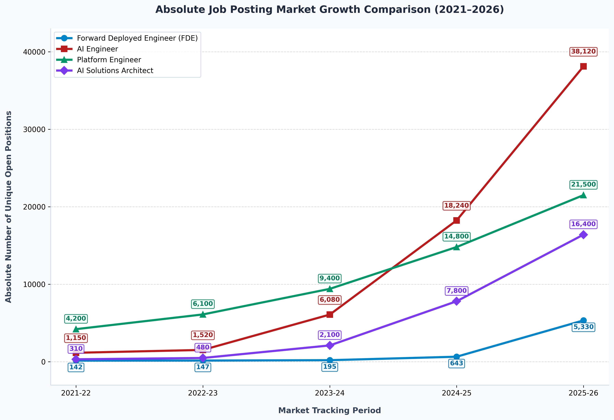

<!--
SEO Metadata:
- Title: Tech Industry Jobs Market Growth Comparison (2021-2026)
- Description: Tracking and visualizing absolute job posting trends for AI Engineers, Platform Engineers, AI Solutions Architects, and Forward Deployed Engineers (FDE).
- Keywords: AI Engineer, Platform Engineer, AI Solutions Architect, Forward Deployed Engineer, Job Trends, Tech Jobs Growth, Software Engineering Careers, Matplotlib Graph
-->


# 📈 Trending Jobs Market Growth Comparison (2021–2026) 🚀

A comprehensive Python data visualization project mapping the exponential growth of emerging technology roles over a 5-year tracking period. 📊 This repository analyzes absolute unique open positions across major job aggregators to visualize key shifts in engineering demand, recruiting trends, and developer hiring markets. 💼

---

## 📊 Market Trend Visualization & Chart 🎨

The plot below highlights the rapid acceleration of AI-focused roles alongside steady infrastructure engineering demand: 📉



---

## 📈 Raw Market Growth Metrics & Job Statistics 📊

Below is the comparative tracking data representing absolute unique job postings per fiscal period: 🗓️

| 🛠️ Role | 📅 2021-22 | 📅 2022-23 | 📅 2023-24 | 📅 2024-25 | 📅 2025-26 | 🚀 5-Year Growth |
| :--- | :---: | :---: | :---: | :---: | :---: | :---: |
| **🤖 AI Engineer** | 1,150 | 1,520 | 6,080 | 18,240 | 38,120 | **~33.1x** |
| **☁️ Platform Engineer** | 4,200 | 6,100 | 9,400 | 14,800 | 21,500 | **~5.1x** |
| **🧠 AI Solutions Architect** | 310 | 480 | 2,100 | 7,800 | 16,400 | **~52.9x** |
| **💼 Forward Deployed Engineer (FDE)** | 142 | 147 | 195 | 643 | 5,330 | **~37.5x** |

### 🔍 Key Insights & Trend Analysis 💡
- **🧠 AI Solutions Architects** experienced the highest relative surge (**~52.9x**), driven by enterprises transitioning from AI experimentation to production deployment. 📈
- **🤖 AI Engineers** commands the highest absolute volume by 2025-26 with **38,120** active postings. 🔝
- **💼 Forward Deployed Engineering (FDE)** postings remained low initially but spiked heavily in the 2025-26 cycle as companies sought engineers to deploy specialized workflows directly within client environments. ⚡

---

## 🛠️ Setup & Execution Guide ⚙️

### 📋 Prerequisites
Make sure you have Python 3 installed along with `matplotlib`: 🐍
```bash
pip install matplotlib
```

### 🚀 Run the Generator
To view the interactive graph and update the saved plot in `assets/`: 🖥️
```bash
python trending_jobs.py
```
